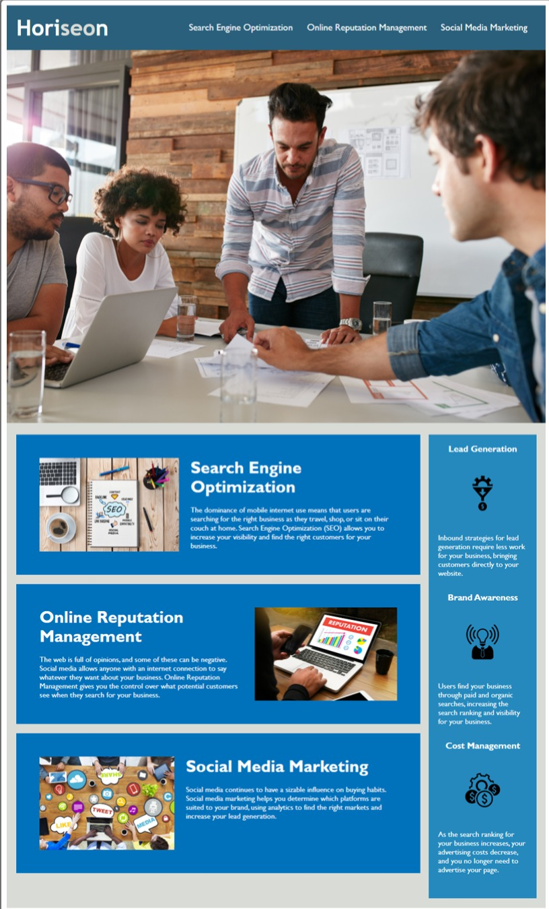

# ProjectOne

This is the first project assigned to us as part of the University of Adelaide's coding boot camp. The aim was to
refactor an existing webpage.

## Table of Contents

- [Features](#features)
- [Link-to-Webpage](#Link-to-Webpage)
- [Appearance](#Appearance)
- [About-Developer](#About-developer)

## About-developer

Hi my name is Molaligne (Mola) Dafa. I am currently taking part in a coding boot camp and this is my first project. 
In it, I have attempted to fix any issues regarding accessibility, functionality and good coding practices.

## Features

- Function nav bar.
- semantic HTML design.
- Accessible design features, such as alt descriptions of images.
  
## Link-to-Webpage
- https://mola90.github.io/ProjectOne/

## Appearance

The following image demonstrates the webpage's appearance

